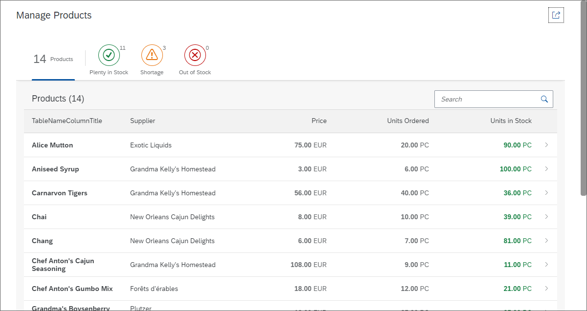

# Quick Filter for the Worklist

Để dễ dàng phát hiện và quản lý tình trạng thiếu sản phẩm trong ứng dụng của chúng ta, chúng ta sẽ thêm một bộ lọc nhanh (quick filter) cho bảng danh sách công việc (worklist table). Người dùng có thể nhấn vào các tab bộ lọc để hiển thị các sản phẩm dựa trên tình trạng tồn kho của chúng, như sản phẩm có trong kho, sản phẩm có ít hàng hoặc không còn hàng. Bảng sẽ tự động cập nhật và chỉ hiển thị các sản phẩm phù hợp với tiêu chí mà người dùng chọn.

Chúng ta sẽ cập nhật view và thêm UI mới cho bộ lọc nhanh vào phần content của control `sap.m.SemanticPage`, ngay trước bảng. Nó được mô hình hóa bằng cách sử dụng control `sap.m.IconTabBar` và `sap.m.IconTabFilter` cho mỗi tùy chọn bộ lọc sau

- `Total Stock`
  Tab này sẽ chỉ đơn giản hiện thị tổng số sản phẩm đã được trả về từ data service. Property `count` đươc liên kết với model xem cục số sẽ được cập nhật trong controller ở bước sau. Tab này sẽ chỉ hiển thị số lớn hơn (tùy chọn) và không có icon bằng cách sử dụng thuộc tính `showAll`.
- `Out of Stock`
  Tab này sẽ hiển thị tất cả các product `Stock out`.Chọn icon `Negative` để nó xuất hiện màu đỏ
- `Shortage`
  Sẽ hiện thị các product có ít hơn 10 sp.với trạng thái icon `Critical` (nghiêm trọng)
- `Plenty in Stock`
  Tab này sẽ hiển thị các sản phẩm có hơn 10 sản phẩm còn lại trong kho. Trạng thái Positive (tích cực) sẽ làm cho biểu tượng xuất hiện màu xanh lá cây. Như thường lệ, văn bản UI cho các tab sẽ được liên kết với tệp `resource bundle` và sẽ được thêm vào sau. Đừng quên đặt lớp CSS chuẩn `sapUiNoMarginTop` cho bảng để loại bỏ khoảng cách giữa `IconTabBar` và bảng, giúp giao diện trở nên đẹp mắt hơn.

> Mỗi phần tử `IconTabFilter` có một thuộc tính key được sử dụng để xác định tab được nhấn trong trình xử lý sự kiện `onQuickFilter` được đăng ký trực tiếp trên điều khiển `IconTabBar`. Việc triển khai trình xử lý sự kiện thực hiện lọc thực tế trên bảng và được xác định trong controller
