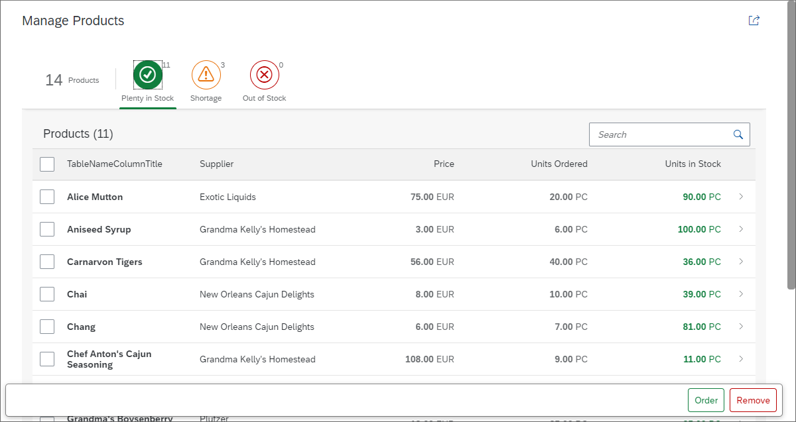

# Adding Actions to the Worklist

Bây giờ chúng ta có thể dễ dàng phát hiện tình trạng thiếu hàng trong stock, nhưng muốn thực hiện hành động để giải quyết vấn đề này. Chúng ta có thể loại bỏ product cho đến khi tình trạng thiếu hàng được giải quyết và đặt hàng product mới. Trong bước này vào phần footer các action của bảng worklist



Thêm lựa chọn bằng cách thêm mode "MultiSelect"

```xml
<Table
	id="table"
	busyIndicatorDelay="{worklistView>/tableBusyDelay}"
	growing="true"
	growingScrollToLoad="true"
	noDataText="{worklistView>/tableNoDataText}"
	updateFinished=".onUpdateFinished"
	width="auto"
	mode="MultiSelect" // Thêm checkbox để click

	items="{
  }">
```

Đã chọn được các item của table. Cho phép chọn nhiều item trong table. Chúng ta sẽ thêm button footer, button đầu là thêm `UnitsInStock` property và button 2 sẽ loại bỏ các item vừa chọn.

```xml

	 <semantic:SemanticPage
		  id="page"
		  headerPinnable="false"
		  toggleHeaderOnTitleClick="false"
		  showFooter="true"> // Thêm footer

		  <semantic:titleHeading>
				<Title text="{i18n>worklistTitle}"/>
		  </semantic:titleHeading>
		  ...
	 </semantic:headerContent>
	 <semantic:sendEmailAction>
		  <semantic:SendEmailAction id="shareEmail" press=".onShareEmailPress"/>
	 </semantic:sendEmailAction>
	 <!-- Thêm  2 button ở footer -->
	 <semantic:positiveAction>
		  <semantic:PositiveAction text="{i18n>TableProductsReorder}" press=".onUpdateStockObjects"/>
	 </semantic:positiveAction>
	 <semantic:negativeAction>
		  <semantic:NegativeAction text="{i18n>TablePorductsUnlist}" press=".onUnlistObjects"/>
	 </semantic:negativeAction>
```

`positiveAction` button tích cực

`negativeAction` button tiêu cực

Button đầu tiên sẽ đặt hàng các mặt hàng mới của các sản phẩm đã chọn và nút thứ hai sẽ xóa chúng

```js
sap.ui.define([
	"./BaseController",
	"sap/ui/model/json/JSONModel",
	"myCompany/myApp/model/formatter",
	"sap/ui/model/Filter",
	"sap/ui/model/FilterOperator",
	"sap/m/MessageToast", //
	"sap/m/MessageBox"  //

], function(BaseController, JSONModel, formatter, Filter, FilterOperator, MessageToast, MessageBox) {
	"use strict";

	return BaseController.extend("myCompany.myApp.controller.Worklist", {

		formatter: formatter,

...

		/**
		 * Displays an error message dialog. The displayed dialog is content density aware.
		 * @param {string} sMsg The error message to be displayed
		 * @private
		 */
		_showErrorMessage: function(sMsg) {
			MessageBox.error(sMsg, {
				styleClass: this.getOwnerComponent().getContentDensityClass()
			});
		},

		/**
		 * Event handler when a filter tab gets pressed
		 * @param {sap.ui.base.Event} oEvent the filter tab event
		 * @public
		 */
		onQuickFilter: function(oEvent) {
			var oBinding = this._oTable.getBinding("items"),
				sKey = oEvent.getParameter("selectedKey");

			oBinding.filter(this._mFilters[sKey]);
		},

		/**
		 * Error and success handler for the unlist action.
		 * @param {string} sProductId the product ID for which this handler is called
		 * @param {boolean} bSuccess true in case of a success handler, else false (for error handler)
		 * @param {number} iRequestNumber the counter which specifies the position of this request
		 * @param {number} iTotalRequests the number of all requests sent
		 * @private
		 */
		_handleUnlistActionResult : function (sProductId, bSuccess, iRequestNumber, iTotalRequests){
			// we could create a counter for successful and one for failed requests
			// however, we just assume that every single request was successful and display a success message once
			if (iRequestNumber === iTotalRequests) {
				MessageToast.show(this.getModel("i18n").getResourceBundle().getText("StockRemovedSuccessMsg", [iTotalRequests]));
			}
		},

		/**
		 * Error and success handler for the reorder action.
		 * @param {string} sProductId the product ID for which this handler is called
		 * @param {boolean} bSuccess true in case of a success handler, else false (for error handler)
		 * @param {number} iRequestNumber the counter which specifies the position of this request
		 * @param {number} iTotalRequests the number of all requests sent
		 * @private
		 */
		_handleReorderActionResult : function (sProductId, bSuccess, iRequestNumber, iTotalRequests){
			// we could create a counter for successful and one for failed requests
			// however, we just assume that every single request was successful and display a success message once
			if (iRequestNumber === iTotalRequests) {
				MessageToast.show(this.getModel("i18n").getResourceBundle().getText("StockUpdatedSuccessMsg", [iTotalRequests]));
			}
		},

		/**
		 * Event handler for the unlist button. Will delete the
		 * product from the (local) model.
		 * @public
		 */
		onUnlistObjects: function() {
			var aSelectedProducts, i, sPath, oProduct, oProductId;

			aSelectedProducts = this.byId("table").getSelectedItems();
			if (aSelectedProducts.length) {
				for (i = 0; i < aSelectedProducts.length; i++) {
					oProduct = aSelectedProducts[i];
					oProductId = oProduct.getBindingContext().getProperty("ProductID");
					sPath = oProduct.getBindingContext().getPath();
					this.getModel().remove(sPath, {
						success : this._handleUnlistActionResult.bind(this, oProductId, true, i+1, aSelectedProducts.length),
						error : this._handleUnlistActionResult.bind(this, oProductId, false, i+1, aSelectedProducts.length)
					});
				}
			} else {
				this._showErrorMessage(this.getModel("i18n").getResourceBundle().getText("TableSelectProduct"));
			}
		},


		/**
		 * Event handler for the reorder button. Will reorder the
		 * product by updating the (local) model
		 * @public
		 */
		onUpdateStockObjects: function() {
			var aSelectedProducts, i, sPath, oProductObject;

			aSelectedProducts = this.byId("table").getSelectedItems();
			if (aSelectedProducts.length) {
				for (i = 0; i < aSelectedProducts.length; i++) {
					sPath = aSelectedProducts[i].getBindingContext().getPath();
					oProductObject = aSelectedProducts[i].getBindingContext().getObject();
					oProductObject.UnitsInStock += 10;
					this.getModel().update(sPath, oProductObject, {
						success : this._handleReorderActionResult.bind(this, oProductObject.ProductID, true, i+1, aSelectedProducts.length),
						error : this._handleReorderActionResult.bind(this, oProductObject.ProductID, false, i+1, aSelectedProducts.length)
					});
				}
			} else {
				this._showErrorMessage(this.getModel("i18n").getResourceBundle().getText("TableSelectProduct"));
			}
		}
	});
});
```

`sap.m.MessageBox` : tạo 1 hộp thoại xác nhận , cảnh báo tiêu chiểu, hoặc hộp thoại thông báo

`sap.m.MessageBox.error` : Hiển thị hộp thoại error

Tiếp theo `sap.m.MessageToast` làm một phụ thuộc mới đế hiển thị thông báo cho cách action gỡ danh sách (`unlist`) và đặt lại hàng (`reorder`).

## Order

Cả 2 action đều có cách triển khai tương tự và chi tiết được mô tả dưới đây. Cả hai đều lặp qua các mục được chọn trong bảng và thực hiện cập nhật hoặc xóa dữ liệu trên đường dẫn được chọn trong model. Sau đó, một thông báo thành công hiển thị số lượng sản phẩm đã được xử lý. Bảng sẽ được cập nhật tự động bởi thay đổi trong model.

Đường dẫn liên kết (`binding path`) trong model được lấy bằng `getBindingContext().getPath()` trên item đó. Chỉ cần thêm 10 items vào giữ mọi thứ đơn giản. Sau đó gọi hàm update trên model với đường đẫn sản phẩm (product path) và đối tượng mới.

Hành động này sẽ kích hoạt một yêu cầu cập nhật OData đến back-end và sau đó làm mới model (nhiều yêu cầu được xử lý đồng thời trong chế độ batch). Khi model được làm mới, bảng sẽ được cập nhật tự động nhờ vào cơ chế liên kết (`binding`) của nó.

## Remove

Đối với mỗi item được chọn, tiếp tục dùng đường dẫn (`binding path`) bằng cách `getBindingContext().getPath()`. Rồi gọi hàm `remove` trên model `(product path)`. Điều này sẽ kích hoạt một yêu cầu xóa (`delete request`) OData đến back-end và làm mới model OData sau đó.

Tương tự, khi model được làm mới, bảng sẽ được cập nhật tự động nhờ cơ chế liên kết (binding) của nó. ODataModel v2 thu thập tất cả các yêu cầu này và chỉ gửi một yêu cầu gộp (batch request) (hành vi mặc định này có thể thay đổi).

Đối với mỗi action, chúng tôi success handler và error handle. Điều này cho phép xử lý error handle và success handler. Bên trong các function
