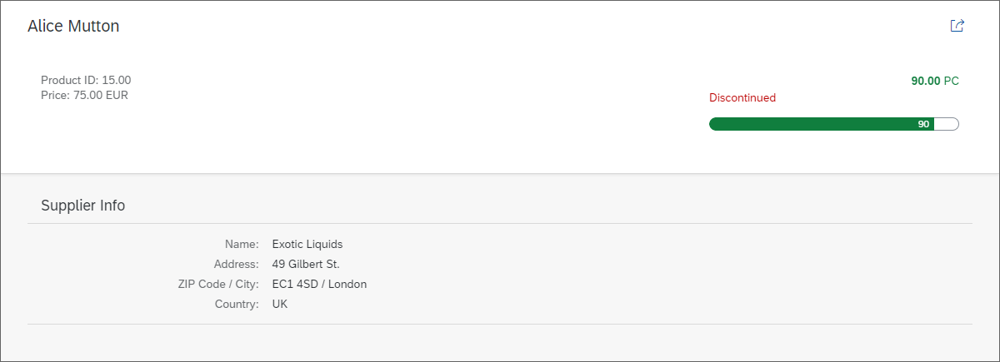

# Extending the Detail Page

`headerContent` cũng như thêm 1 số property cho product `sap.m.ObjectAttribute` một cho `Price` (Giá) và một cho `ProductID` (ID sản phẩm). Điều có hình ảnh trực quan hơn về tình trạng, đưa chúng vào phần

Để có hình ảnh trực quan hơn về tình trạng tồn kho hiện tại của sản phẩm đang hiển thị, chúng ta sử dụng các trạng thái của `ObjectStatus` và `ProgressIndicator`. Nếu sản phẩm của chúng ta không được sản xuất nữa, `ObjectStatus` sẽ hiển thị trạng thái Discontinued (Ngừng sản xuất). `ProgressIndicator` sử dụng cùng một hàm định dạng như `UnitsInStock` (trong trạng thái của `ObjectNumber`).

Bên dưới phần tiêu đề đối tượng (ObjectHeader), chúng ta có thể sử dụng `sap.m.Panel` để hiển thị một số thông tin bổ sung với bố cục đẹp trên trang. Bên trong Panel, chúng ta sử dụng `sap.ui.layout.form.SimpleForm` để căn chỉnh các nhãn và văn bản mà chúng ta muốn hiển thị.
