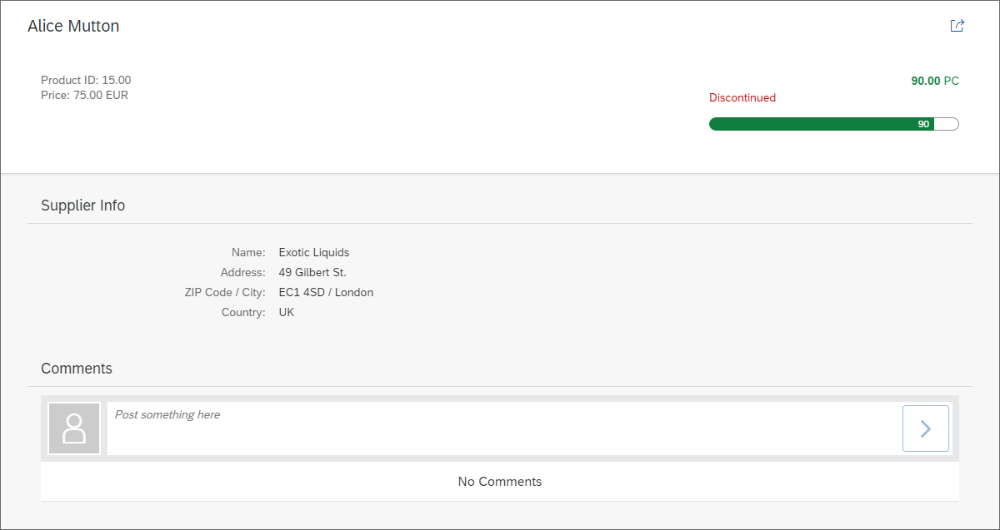

# Adding a Comments Section

Thêm tính năng comments cho product



**Comments section added to the detail page**

```xml
<mvc:View
    controllerName="mycompany.myapp.MyWorklistApp.controller.Object"
    xmlns="sap.m"
    xmlns:mvc="sap.ui.core.mvc"
    xmlns:semantic="sap.f.semantic"
    xmlns:form="sap.ui.layout.form"
    xmlns:l="sap.ui.layout">

...

        <semantic:content>
            <l:VerticalLayout width="100%">
            <Panel
                backgroundDesign="Transparent"
                headerText="{i18n>ObjectSupplierTabTitle}">

...
            </Panel>
                <Panel
                    backgroundDesign="Transparent"
                    headerText="{i18n>ObjectCommentsTabTitle}">
                    <content>
                        <FeedInput post=".onPost"/>
                        <List
                            id="idCommentsList"
                            noDataText="{i18n>ObjectCommentNoData}"
                            showSeparators="Inner"
                            items="{
                                path: 'productFeedback>/productComments',
                                sorter: {
                                    path: 'date',
                                    descending: true
                                }
                            }">
                            <FeedListItem
                                info="{productFeedback>type}"
                                text="{productFeedback>comment}"
                                timestamp="{productFeedback>date}"/>
                        </List>
                    </content>
                </Panel>
            </l:VerticalLayout>
        </semantic:content>
```

chúng tôi add `VerticalLayout` để chia bố cục

Bên dưới panel 1 hiện có, chúng thêm panel 2 khác đóng vai trò là 1 container là nơi chứa `comment` của chúng tôi. Đặt 2 cái panel trong `vertical layout` vì
`sap.f.semanticPage` chỉ cho phép 1 control điều khiển tổng hợp. Bên trong Panel 2, chúng ta thêm một control `sap.m.FeedInput` và gắn event handler `onPost` cho event `post`.Control này sẽ hiển thị khi một trường nahap và một button, cho phép người dùng đăng comment. Event handler mà chúng ta đã đăng ký được triển khai bên dưới.

Dưới control `FeedInput`, chúng ta thêm list danh sách all comment. `aggregation` các list `/productComments` mà chúng tôi sẽ tạo bên dưới. All comment sẽ được hiển thị giảm dần dựa vào `publishing date`. Cấu hình sắp xếp cho các item của list

Template là một control `FeedListItem`.FeedListItem chỉ để ddawng ngày của post, type bài postm nội dung bài post

```js
...
/*global location*/
sap.ui.define([
   "myCompany/myApp/controller/BaseController",
   "sap/ui/model/json/JSONModel",
   "sap/ui/core/routing/History",
   "myCompany/myApp/model/formatter",
   "sap/ui/core/date/UI5Date",
   "sap/ui/core/format/DateFormat",
   "sap/ui/model/Filter",
   "sap/ui/model/FilterOperator"
], function(BaseController, JSONModel, History, formatter, UI5Date, DateFormat, Filter, FilterOperator) {
   "use strict";
   return BaseController.extend("myCompany.myApp.controller.Object", {
      formatter: formatter,
      ...
      _onBindingChange: function(oEvent) {
         ...
         // Update the comments in the list
         var oList = this.byId("idCommentsList");
         var oBinding = oList.getBinding("items");
         oBinding.filter(new Filter("productID", FilterOperator.EQ, sObjectId));
      },
      /**
      * Updates the model with the user comments on Products.
      * @function
      * @param {sap.ui.base.Event} oEvent object of the user input
      */
      onPost: function (oEvent) {
         var oFormat = DateFormat.getDateTimeInstance({style: "medium"});
         var sDate = oFormat.format(UI5Date.getInstance());
         var oObject = this.getView().getBindingContext().getObject();
         var sValue = oEvent.getParameter("value");
         var oEntry = {
             productID: oObject.ProductID,
             type: "Comment",
             date: sDate,
             comment: sValue
         };
         // update model
         var oFeedbackModel = this.getModel("productFeedback"); // trả về model  `productFeedback`
         console.log(oFeedbackModel)
         var aEntries = oFeedbackModel.getData().productComments; // lấy data từ model đó
         aEntries.push(oEntry);
         oFeedbackModel.setData({
            productComments : aEntries
         });
      }
   });
});
```

Thêm 3 dependencies controller.Chúng tôi cần những dependencies vì chúng tạo filter cho list và format date và time cùa bài post.

Bất cứ khi nào binding cua detail view thay đổi, chúng ta muốn đảm bảo rằng các comment cho sp hiện tahi được hiển thị. Do đó , thay đổi hàm
`_onBindingChange` và cập nhật bộ lọc của danh sách hiển thị các bình luận bằng cách lấy tham chiếu đến binding của items `aggregation` của danh sách và gọi API filter() sau đó. Bộ lọc được truyền vào API filter(). Chúng ta sử dụng productID làm tiêu chí lọc, vì chúng ta chỉ muốn các comment cho một sản phẩm cụ thể.

Event handler cho sự post của `FeedInput` được triển khai.Handle onPost, chúng ta tạo một đối tượng `entry` mới chứa tất cả dữ liệu mà chúng ta muốn lưu trữ trong model của mình. Dữ liệu này bao gồm productId, loại bài đăng (được mã hóa cứng trong ví dụ của chúng ta), ngày hiện tại ở định dạng ngày trung bình và bình luận. Bình luận được lấy từ đối tượng sự kiện. ProductId được xác định bằng cách gọi `getObject()` trên binding context của view.

Cuối cùng, entry mới được thêm vào model có tên là `productFeedback`. Model này chưa tồn tại, vì vậy chúng ta sẽ tạo nó tiếp theo

Trong object view(detail page) cũng như controller, chúng tôi đã sử dụng một model được đặt tên `productFeedback`.Trong ví dụ, model này là `JSONMODEL` đơn giản. Nó tạo trong hàm `createCommentsModel()` trong file model.js. Như bạn thấy ở trên JSONModel với một đối tượng đơn giản. Property `ProductComments` là [] và nó sẽ được update mỗi khi ai comment.

```js
sap.ui.define([
   "sap/ui/core/UIComponent",
   "sap/ui/Device",
   "./model/models",
   "./controller/ErrorHandler"
], function(UIComponent, Device, models, ErrorHandler) {
   "use strict";
   return UIComponent.extend("myCompany.myApp.Component", {
      ...
      init: function() {
         // call the base component's init function
         UIComponent.prototype.init.apply(this, arguments);

         // initialize the error handler with the component
         this._oErrorHandler = new ErrorHandler(this);

         // set the device model
         this.setModel(models.createDeviceModel(), "device");

         // set the product feedback model
         this.setModel(models.createCommentsModel(), "productFeedback");


         // create the views based on the url/hash
         this.getRouter().initialize();
      },
      ...
   });
});
```

Bây giờ là lúc để làm cho model có tên productFeedback có sẵn cho ứng dụng của chúng ta.Do đó, chỉ cần thay đổi hàm init của file Component.js bằng cách gọi phương thức `createCommentsModel()` của chúng ta và thiết lập model trả về trên component. Sau đó, model của chúng ta sẽ có thể truy cập được trong ứng dụng.
